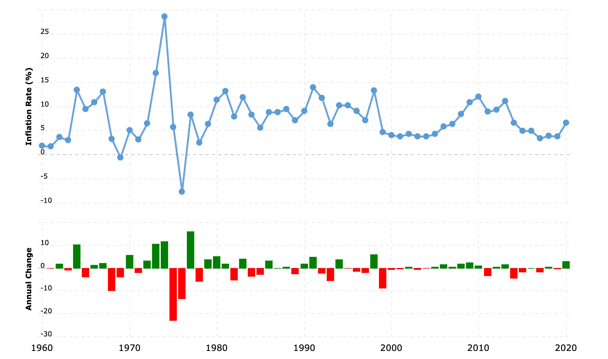

## Popular class of investments

- Equity
    - stocks
    - ETFs
    - Mutual Funds
- Debts
    - Fixed deposits
    - Recurring deposits (chits)
    - Corporate bonds
- Gold
    - Physical gold
    - Soverign Bonds
    - ETFs
- Bitcoins
- PF/ PPF
- Real Estates

## Things which are not investments

- Home
- Car
- Insurance policies
- Jewels
- Keeping it as cash

## Inflation

Inflation rate is the rate at which the general goods and service cost changes in an economy. 

The chart below shows the change in inflation rate for India over the years. We are approximate it as 6-7% as of now. Hence, the growth that we are getting from standard FDs from Banks will actually decay the value of our money in the future.

Typically, the interest rates provides for FDs will be just matching or above the inflation rate in that time period.

Take away is that, we need to place most percentage of our money in the investment classes where we can get an expected return which is more than the FDs.

